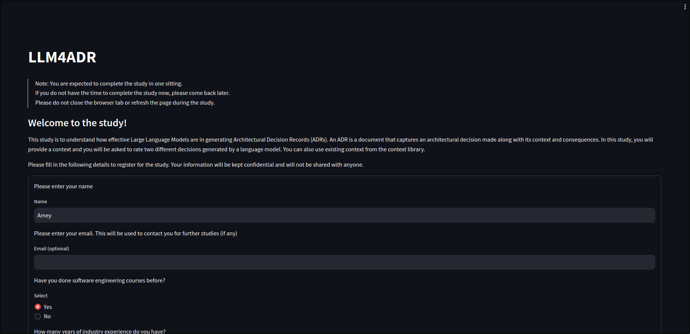
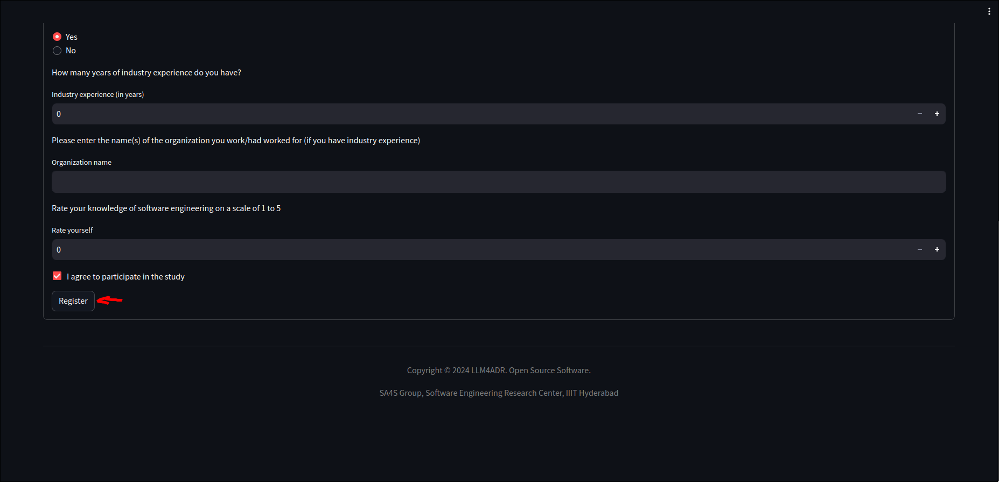
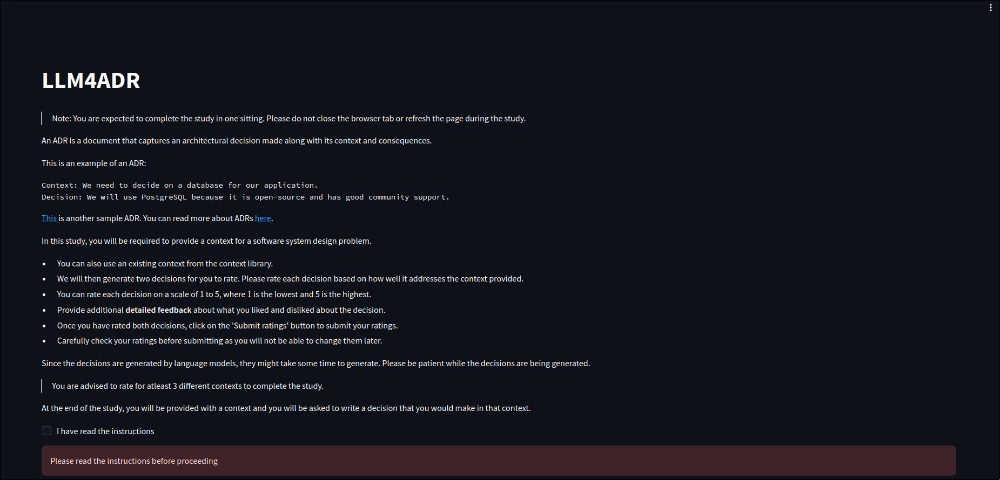
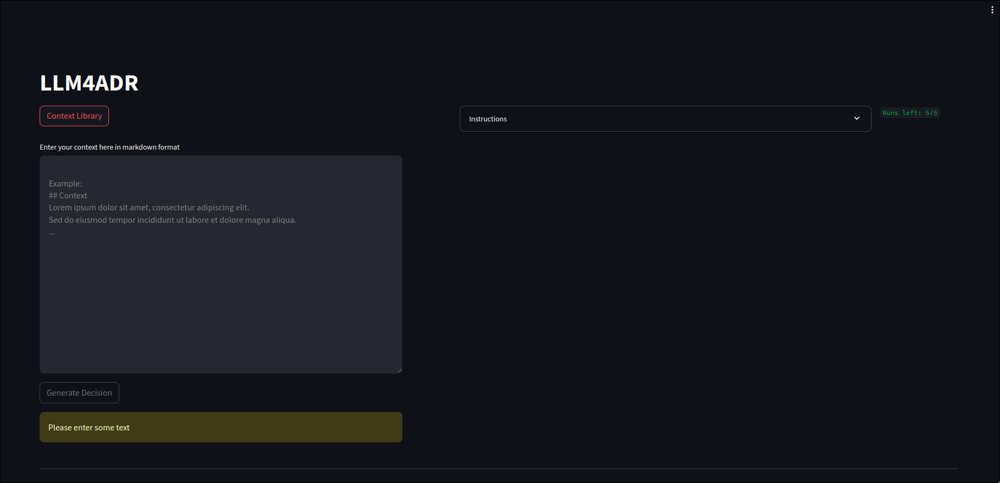
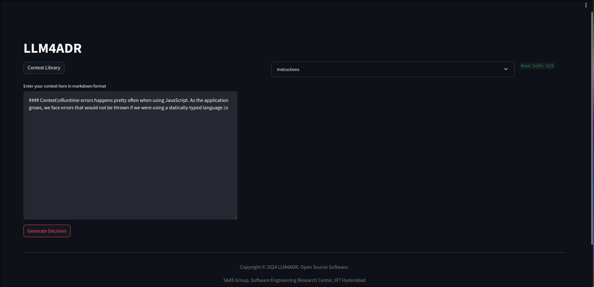
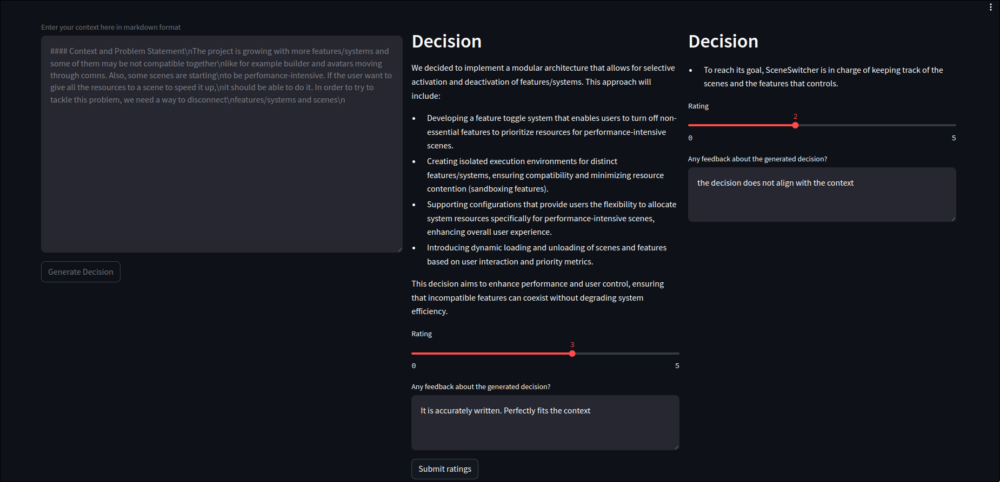
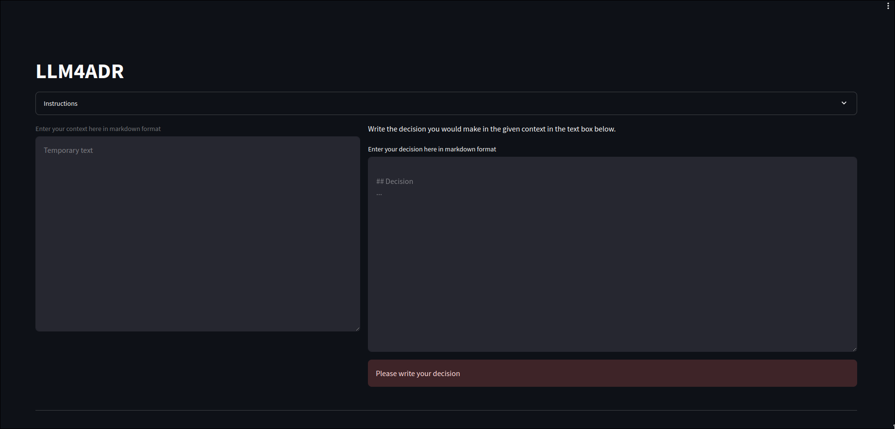
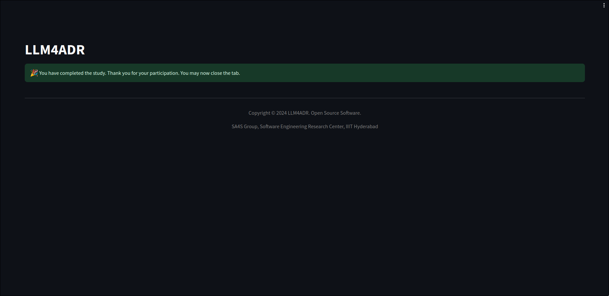

# LLM4ADR Study

**Note**: You are expected to complete the study in one sitting. The study will take approximately 15-20 minutes to complete. Please do not refresh the page or navigate away from the page during the study.

## Initial Page

Fill in details like your name, and knowledge about software engineering.
If you have industry experience, you can mention that as well.

## Instructions

Read the instructions carefully and acknowledge that you have read them.

## Experiment

1. You can choose a context from the `Context Library`.

or write your own context.

2. Click the button to generate the decisions.

3. Wait for the decisions to be generated.

4. Rate the decsiions and optionally provide feedback of what you liked or disliked.

5. Submit your feedback and repeat the process for four more times.

6. When all your runs are exhausted (5 runs), you will be asked to write a decision for the given context.

7. Submit your decision and this will conclude the experiment.

